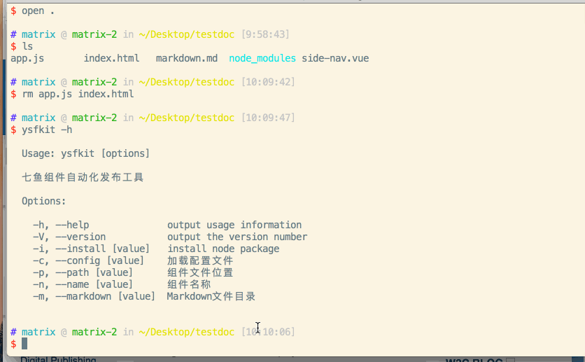

# 七鱼组件代码自动化发布工具 

## 命令安装
> sudo npm install ysfkit -g


## 命令启动
> ysfkit -h   ## 帮助命令

```
  Usage:  ysfkit [options...]

  Options:
    -c,--config         配置文件
    -n,--name           组件名称
    -m,--markdown       markdown地址
    -i,--install        初始化安装npm依赖包
    -p,--path           组件地址或者npm组件包名称
```

## 使用方式
### shell

```shell
   sudo ysfkit -m ./markdown.md -p sf-button -n sf-button
```

### config

```json
    {
        "name" : "sf-button",         // markdown 组件名称
        "path" : "sf-button",         // 组件包名称
        "markdown": "./markdown.md"
    }
```

## 栗子


