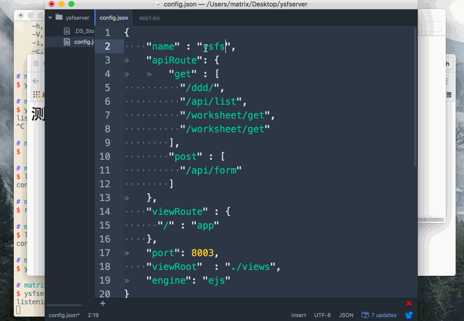

# 七鱼组件代码自动化发布工具

## 命令安装
> sudo npm install ysfkit -g


## 命令启动
> ysfkit -h   ## 帮助命令

```
  Usage:  ysfkit [options...]

  Options:
    -c,--config         配置文件
    -n,--name           组件名称
    -m,--markdown
```


## config.json

```json
    {
        "name" : "sf-button",
        "path" : "./src/button.js", // 组件地址
        "markdown": "./markdown.md"
    }
```

## query

```js
    ysfkit -m "./markdown.md" -p "./src/button.js" -n "sf-button"
```


## 栗子


